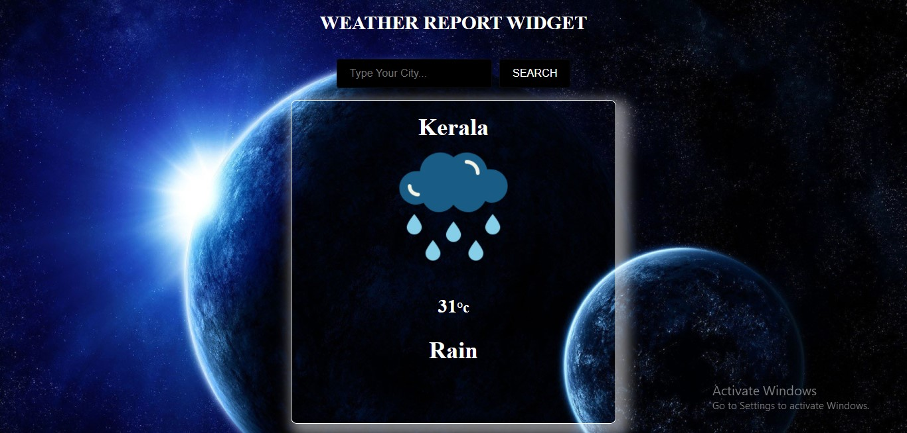
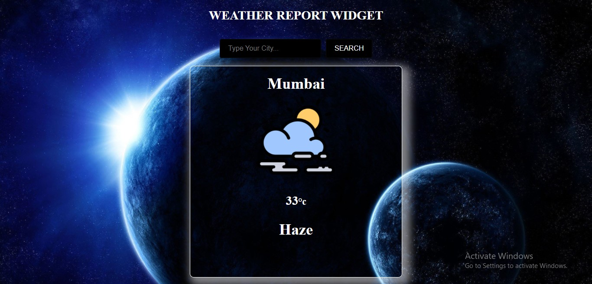
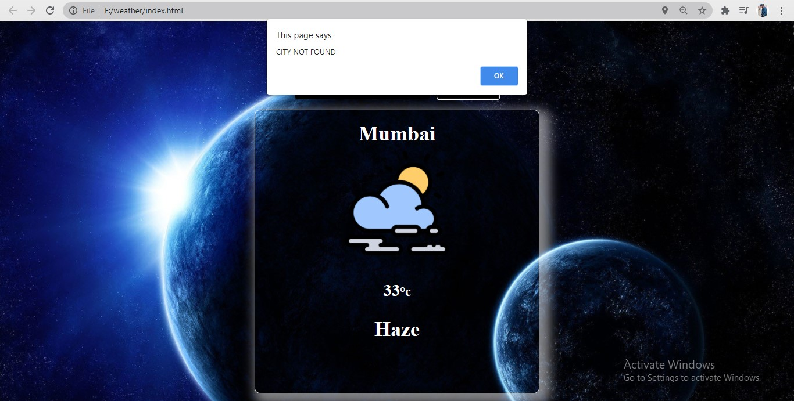

# weather-widget

**A weather WIDGET APP which intially asks for the location and fetches the data**  

**It has a search Input which asks for the city and after clicking on search button it fetches the data from API and display it** 
 
**It also gives "NO CITY FOUND" for wrong input** 

